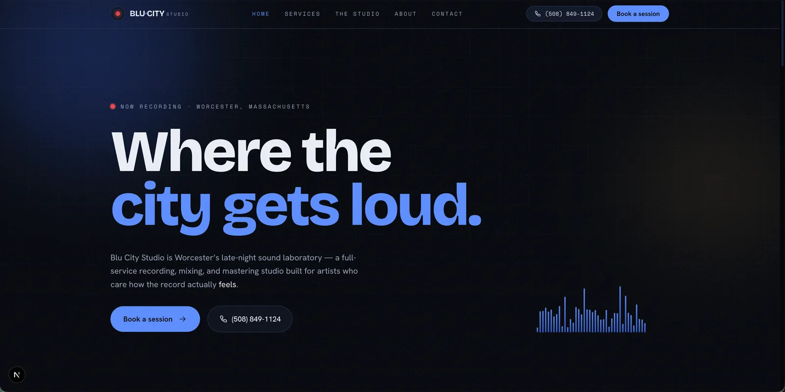

# Blu City Studio

Marketing site for **Blu City Studio** — a recording, mixing, and mastering studio in Worcester, Massachusetts.



A late-night, cinematic design: midnight-blue canvas, an electric "Blu" glow accent, a warm amber lamp tone, film grain, animated equalizer bars, and scroll-reveal motion throughout.

## Pages

- **Home** (`/`) — hero, studio stats, services overview, workflow, testimonials, hours
- **Services** (`/services`) — detailed services, pricing, add-ons
- **The Studio** (`/studio`) — rooms and gear locker
- **About** (`/about`) — story, values, team
- **Contact** (`/contact`) — booking form, phone, email, address, hours

## Tech stack

- [Next.js 16](https://nextjs.org) (App Router) + TypeScript
- [Tailwind CSS v4](https://tailwindcss.com)
- [`next/font`](https://nextjs.org/docs/app/building-your-application/optimizing/fonts): Bricolage Grotesque (display), Hanken Grotesk (body), Space Mono (labels)

## Getting started

```bash
npm install
npm run dev
```

Open [http://localhost:3000](http://localhost:3000) in your browser.

## Scripts

```bash
npm run dev     # start the dev server
npm run build   # production build
npm run start   # serve the production build
npm run lint    # run eslint
```

## Notes

- Studio details (phone, email, hours, address, social links) live in `src/lib/site.ts`.
- Page content (services, gear, rooms, testimonials) lives in `src/lib/content.ts`.
- The contact form (`src/components/contact-form.tsx`) is front-end only — wire it to an email service or CRM to send real booking requests.
- The address is currently a placeholder; swap in the real one before launch.
